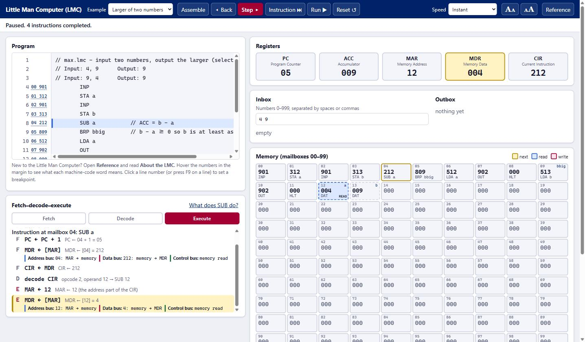

# Little Man Computer (LMC) Simulator

**A free, in-browser simulator for teaching and learning assembly language and the fetch–decode–execute cycle, built to help teach OCR A Level Computer Science (H446).**

### [▶ Open the simulator](https://nivagswerdna.github.io/ocrasm/)

No install, no sign-up, no adverts. It runs entirely in your browser.



Write a Little Man Computer program, then run it or **step through it one register transfer at a time** and watch exactly what happens to the PC, MAR, MDR, CIR and accumulator, which mailbox is being read or written, and what is travelling on the address, data and control buses.

---

## What is the Little Man Computer?

The **Little Man Computer (LMC)** is a very simple model of a computer, designed by Stuart Madnick at MIT in 1965 to show how a processor runs a program. Imagine a little man working in a room:

- The room has **100 mailboxes**, numbered 00 to 99. Each holds one 3-digit number, which is either an **instruction** or some **data**.
- He has an **inbox** and an **outbox** for numbers coming in and going out, and a **calculator** (the *accumulator*) that holds one number at a time.
- He follows the program one instruction at a time: **fetch** the instruction from its mailbox, **decode** what it means, then **execute** it. That is the *fetch–decode–execute cycle*, and it is what a real processor does, billions of times a second.

There are only eleven instructions, so a whole program fits on one screen and a student can trace it by hand:

| Mnemonic | Code | What it does |
|---|---|---|
| `ADD` | `1xx` | Add the contents of mailbox `xx` to the accumulator |
| `SUB` | `2xx` | Subtract the contents of mailbox `xx` from the accumulator |
| `STA` | `3xx` | Store the accumulator in mailbox `xx` |
| `LDA` | `5xx` | Load the contents of mailbox `xx` into the accumulator |
| `BRA` | `6xx` | Branch always to `xx` |
| `BRZ` | `7xx` | Branch to `xx` if the accumulator is zero |
| `BRP` | `8xx` | Branch to `xx` if the accumulator is zero or positive |
| `INP` | `901` | Input a number into the accumulator |
| `OUT` | `902` | Output the accumulator |
| `HLT` | `000` | End the program |
| `DAT` | | Reserve a mailbox and give it a name (and optionally a starting value) |

## Free to use in your teaching

This project is **free for teachers and students**, in the classroom and at home, and is released under the [MIT licence](LICENSE): use it, share the link, copy it onto your school's own web space, or adapt it for your own lessons.

It is designed for **OCR A Level Computer Science (H446)**:

- **1.2.4(c)** – assembly language, following and writing simple programs with the LMC instruction set (Appendix 5d of the specification).
- **1.1.1(a) and (b)** – the ALU, control unit and registers (PC, ACC, MAR, MDR, CIR), the buses, and the effect of the fetch–decode–execute cycle on the registers.
- It also shows the *stored-program concept* very clearly: instructions and data are the same kind of number, in the same memory.

> **Not affiliated with OCR.** This is an independent project and has not been endorsed by OCR. The instruction names follow OCR's published specification, and the fetch–decode–execute steps follow OCR's registers and terminology, but the plain-English explanations are this project's own wording. OCR's specification and past papers are always the authority: please check anything you hand to students as exam guidance against them.

---

## Using the simulator

### Quick start

1. **[Open the simulator](https://nivagswerdna.github.io/ocrasm/)** and choose **Add two numbers** from the **Example** list. The program appears in the **Program** box, and the numbers to feed it appear in the **Inbox**.
2. Press **Step ▸** again and again. Each press performs **one register transfer** of the fetch–decode–execute cycle (`MAR ← PC`, `PC ← PC + 1`, `MDR ← [MAR]`…). Watch the registers, the memory and the **Fetch–decode–execute** panel change.
3. Press **Instruction ⏭** to run one whole instruction, or **Run ▶** to run the whole program. **◂ Back** undoes a step and **Reset ↺** starts again.

New to the LMC? Open **Reference** (top right) and read **About the LMC**.

### What is on the screen

| Part | What it shows |
|---|---|
| **Program** | Your assembly code, with the address and machine code of each line in the margin. **Hover** over the margin numbers to see what a machine-code word means (opcode, operand, effect). Click a **line number** (or press `F9`) to set a **breakpoint**. The line about to run is highlighted. |
| **Registers** | PC, ACC, MAR, MDR and CIR. A register that has just changed is highlighted. |
| **Fetch–decode–execute** | The steps of the current instruction in register-transfer notation, with the real values, and what travels on the **address, data and control buses** whenever memory is read or written. **What does … do?** opens the reference for that instruction. |
| **Memory** | All 100 mailboxes, each showing its address, label, value and the instruction it decodes to. The next instruction, and mailboxes just read or written, are highlighted. **Double-click** a mailbox to change its value. |
| **Inbox / Outbox** | Type the numbers your program will read. If it needs a number and the inbox is empty, it asks you. |
| **Trace table** | One row per instruction executed: PC, CIR, instruction, accumulator, any mailbox written, and any output. |
| **Reference** | A side panel with the instruction set, the machine, how to write code, the fetch–decode–execute steps and common mistakes. It can be **docked** beside the simulator. |

### Writing your own program

```
label     MNEMONIC   operand      // a comment
```

```
        INP             // read a number
        STA first       // remember it
        INP             // read another
        ADD first       // add the first
        OUT             // show the answer
        HLT
first   DAT             // a mailbox to hold the first number (after HLT!)
```

- One instruction per line. A **label** (a name for a mailbox) is optional and comes first.
- The operand is a **label** or a **mailbox number**. The instruction always uses the **contents** of that mailbox: `LDA 10` loads what is *stored in* mailbox 10, not the number 10. To add a constant, store it with `DAT` first (`one DAT 1`, then `ADD one`).
- **Put `DAT` lines after `HLT`.** Otherwise the CPU runs into them and tries to execute the data as instructions. (There is an example of exactly this mistake in the Example list.)
- There is no compare instruction: use `SUB` then `BRZ` (equal) or `BRP` (greater than or equal).
- `//` starts a comment. Labels are not case-sensitive.
- OCR's alternative names are accepted too: `STO`, `LOAD`, `BR`, `BZ`, `BP`, `IN`, `INPUT`, `END` and `COB`.
- Mistakes are reported with their **line numbers**, all at once, and click to jump to the line.
- Input numbers are 0 to 999. A runaway loop stops after 10,000 instructions.

### Ideas for the classroom

- **Predict, then step.** Ask students to predict the output and the accumulator after each instruction, then step through to check. **Instruction ⏭** and **◂ Back** make this quick.
- **Make it big.** The two **A** buttons (top right) make everything larger or smaller for a projector or a small screen.
- **Pick a speed.** *Slow* shows each register transfer in turn; *Instant* runs to the end straight away.
- **Break it on purpose.** The **Mistake: data before code** example shows why `DAT` goes after `HLT`.
- **Poke the memory.** Double-click a mailbox to change a value or even an instruction, then run again.
- **Hand trace.** Use the trace table to compare a student's hand trace with the real one.

### The examples

| Example | Shows |
|---|---|
| Add two numbers | sequence and variables |
| Larger of two numbers | selection (`SUB` then `BRP`) |
| Countdown | iteration (`BRZ` and `BRA`) |
| Multiply | a counted loop, repeated addition |
| Running total | a loop ended by a sentinel value (0) |
| Largest / smallest of ten numbers | a loop with a running maximum or minimum |
| Divide with remainder | repeated subtraction |
| Primes: sieve of Eratosthenes | an optional extra (the LMC has no arrays, so it rewrites its own instructions) |
| Array sum (self-modifying) | an optional extra on program-as-data |
| Mistake: data before code | why `DAT` goes after `HLT` |

The programs are plain text files in [`programs/`](programs), so you can copy them into your own lessons.

### Teacher setting: the order of the fetch stage

Textbooks differ on where `PC ← PC + 1` sits in the fetch. By default it comes straight after `MAR ← PC`. Add **`?pc=after`** to the address to put it last, as in OCR's delivery guide for 1.1.1:

`https://nivagswerdna.github.io/ocrasm/?pc=after`

Programs behave identically either way.

---

## Extended mode (a stretch)

The LMC in OCR's specification has one way of addressing memory: the operand is always the address of a mailbox. Add **`?lmc=extended`** to the address for an **invented extended version, which is not part of the OCR specification**, aimed at stretch and challenge work:

`https://nivagswerdna.github.io/ocrasm/?lmc=extended`

It is clearly labelled *Extended LMC · not OCR* and adds:

- **Addressing modes**: immediate (`LDA #5`), indirect (`LDA (ptr)`) and indexed (`LDA data,X`), with an **index register X**, an **operand register OPR** and two-word instructions, so you can see each mode's extra memory reads in the fetch–decode–execute panel. OCR's specification (1.2.4(d)) expects students to know the four modes as ideas, and this lets them see them work.
- **Memory-mapped peripherals** (tick a box): three switches and three lamps at mailboxes 94–99, read and written with ordinary `LDA` and `STA`. A binary counter, traffic lights and more are included.
- **`SLEEP n`**: wait *n* milliseconds, for blinking lamps and simple timing.
- Seventeen extra example programs: arrays, searching, bubble sort, a linked list, the sieve of Eratosthenes with an index register, and so on.

The standard simulator never shows any of this, and does not even download the extended examples or reference pages, so students using the normal address only see what is in the specification.

---

## Run it yourself

You need [Node.js](https://nodejs.org) 22.12 or newer.

```bash
git clone https://github.com/NivagSwerdna/ocrasm.git
cd ocrasm
npm install
npm run dev        # open the address it prints
```

| Command | What it does |
|---|---|
| `npm run dev` | Start a local development server |
| `npm test` | Run the test suite |
| `npm run build` | Type-check and build the site into `dist/` |
| `npm run preview` | Serve the built site locally |

The built site is plain static files (`dist/`), so it can be hosted anywhere. This repository publishes it to **GitHub Pages** with the workflow in [`.github/workflows/pages.yml`](.github/workflows/pages.yml): on every push it runs the tests, builds, and deploys. To do the same in your own copy, set **Settings → Pages → Source** to **GitHub Actions**.

### How the project is laid out

| Path | What is in it |
|---|---|
| [`src/engine/`](src/engine) | The assembler and the CPU. No web code: it can be tested on its own. |
| [`src/main.ts`](src/main.ts), [`index.html`](index.html) | The page: editor, registers, memory, trace table |
| [`programs/`](programs) | The example programs, with their expected outputs in `tests.json`. `programs/x/` holds the extended-mode ones. |
| [`docs/OCR_LMC_Reference.md`](docs/OCR_LMC_Reference.md) | Reference notes: the instruction set, syntax, the fetch–decode–execute steps in register-transfer notation, worked traces, exam-style questions and how the simulator behaves |
| [`docs/OCR_LMC_CheatSheet.pdf`](docs/OCR_LMC_CheatSheet.pdf) | A printable two-page cheat sheet of the commands (an editable `.docx` is beside it) |
| [`docs/reference-oracle/`](docs/reference-oracle) | Small, independent reference interpreters used to cross-check the simulator |

### How it is checked

The simulator's answers were not taken on trust. Every example program is run through the engine and compared with its expected output, and the engine is also checked **instruction by instruction** against separate, deliberately simple reference interpreters in `docs/reference-oracle/`. The tests run on every push to GitHub.

---

## Notes and acknowledgements

- The LMC was designed by **Stuart Madnick** (MIT, 1965).
- Many schools also use **Peter Higginson's** LMC simulator, which OCR lists as a resource. This project is an independent implementation, so behaviour in unusual cases (for example what happens when the accumulator goes past 999) may differ. Check anything you are going to teach as "standard".
- Mailboxes hold whole numbers from -999 to 999. The simulator warns if a calculation goes outside that range rather than silently wrapping round.

## One more thing

The table of instructions above is not quite the whole story. There is one more, three letters long, in no specification and in none of the reference pages. It stops the machine, and it doesn't do so politely. Engineers of a certain era joked about it. Keep the fire extinguisher handy.

## Licence

[MIT](LICENSE) © 2026 Gavin Andrews. You are free to use, copy, modify and share this project, including in your school, provided the licence notice stays with it.
